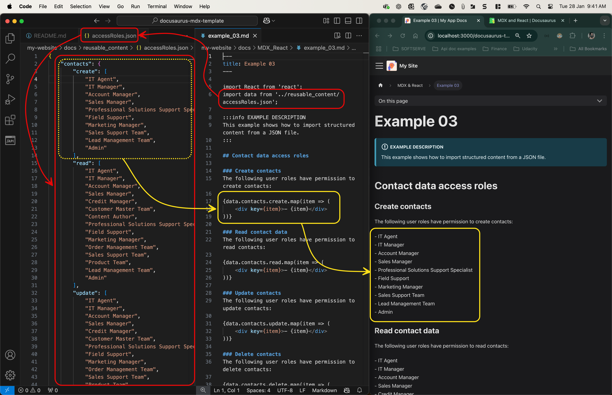

# How to use MDX & React to automate content reuse in Docusaurus <!-- omit in toc -->

- [Introduction](#introduction)
- [Prerequisites](#prerequisites)
- [Example 1: How to import content using MDX](#example-1-how-to-import-content-using-mdx)
  - [Sample files](#sample-files)
  - [Step 1: Create MDX files to host reusable content.](#step-1-create-mdx-files-to-host-reusable-content)
  - [Step 2: Import MDX content into Markdown files](#step-2-import-mdx-content-into-markdown-files)
  - [Step 3: Run Docusaurus](#step-3-run-docusaurus)
- [Example 2: How to use variables within reusable content](#example-2-how-to-use-variables-within-reusable-content)
  - [Sample files](#sample-files-1)
  - [Step 1: Create an MDX file with variables](#step-1-create-an-mdx-file-with-variables)
  - [Step 2: Import MDX content with variables](#step-2-import-mdx-content-with-variables)
  - [Step 3: Run Docusaurus](#step-3-run-docusaurus-1)
- [Example 3: How to import content from a JSON file](#example-3-how-to-import-content-from-a-json-file)
  - [Sample files](#sample-files-2)
  - [Step 1: Create a JSON file to host reusable content](#step-1-create-a-json-file-to-host-reusable-content)
  - [Step 2: Import JSON content into a Markdown file](#step-2-import-json-content-into-a-markdown-file)
  - [Step 3: Run Docusaurus](#step-3-run-docusaurus-2)
- [Example 4: How to create a table using JSON data](#example-4-how-to-create-a-table-using-json-data)
  - [Sample files](#sample-files-3)
  - [Step 1: Prepare Your JSON File](#step-1-prepare-your-json-file)
  - [Step 2: Prepare the Markdown file](#step-2-prepare-the-markdown-file)
  - [Step 3: Run Docusaurus](#step-3-run-docusaurus-3)

## Introduction

With Docusaurus's built-in [MDX and React](https://docusaurus.io/docs/markdown-features/react) capabilities, you can automate content reuse. For example, not only can you reuse content across multiple files, you can also filter and automate data obtained from structured content.

This document contains four independent tutorials that you can go through.

## Prerequisites

- [Docusaurus](https://docusaurus.io/docs) installed on your computer.

  > We used the [docusaurus-template](https://github.com/VasylynaBurger/docusaurus-template) to build the examples in this tutorial.
- A code editor, such as [VS Code](https://code.visualstudio.com/). You'll need to use the code editor throughout the entire tutorial.

## Example 1: How to import content using MDX

You can import content from MDX files into your Markdown files. This allows you to reuse content across multiple files.


Follow the steps to create your own reusable MDX content.

### Sample files

MDX files:

- [`my-website/docs/reusable-content/_loremIpsum.mdx`](my-website/docs/reusable-content/_loremIpsum.mdx)
- [`my-website/docs/reusable-content/_leo.mdx`](my-website/docs/reusable-content/_leo.mdx)

Markdown file:

- [`my-website/docs/MDX-REACT/example_01.md`](my-website/docs/MDX-REACT/example_01.md)

Live demo:

- [`https://mauriceac.github.io/docusaurus-mdx-react-template/docs/MDX-React/example_01`](https://mauriceac.github.io/docusaurus-mdx-react-template/docs/MDX-React/example_01)

### Step 1: Create MDX files to host reusable content. 

1. Choose a folder where you want to store the MDX files that will contain the original reusable content.

   > **Note:** You can place your reusable MDX files anywhere within the project. But it is recommended that you take into consideration where you will store these files when you are creating your information architecture.

2. Create the MDX files.

   The MDX filename must preceded by an underscore `_` and use the `*.mdx` file extension.

   > **Note:** The underscore `_` that goes at the beginning of the MDX file indicates that the file should not be considered to create sidebar links to documents. This means that MDX files will not appear in the Docusaurus sidebar even if the file is stored in a folder where the sidebar is automatically generated.

3. Place the content in the MDX files.

   All the markdown formatting you place in the file will be generated: headers, font styling, tables, links, etcetera.

   > **Note:** In the following section ([Example 2](#example-2-how-to-use-variables-within-reusable-content)), we go over how the MDX content can include variables that you can change everytime the content is reused.

4. Save the MDX file.

### Step 2: Import MDX content into Markdown files

1. Open or create a Markdown file in your Docusaurus project.

2. In your markdown file, add import statements that direct to the reusable content.

    For example:  

    ```jsx
    // ...existing code...

    import LoremIpsum from '../reusable-content/_loremIpsum.mdx'
    import Leo from '../reusable-content/_leo.mdx'
    
    // ...existing code...
    ```

    > **Notes:**
    > - The import variable name must begin with a capital letter. For example, `LoremIpsum`, and not `loremIpsum`.
    > - Ensure the paths are relative from the Markdown to the MDX files. For example, use `../` in the path to go down one folder level.

3. Use placeholders to position the imported content in your Markdown file: `<[IMPORT_VARIABLE] />`

   For example:

   ```jsx
   // ...existing code...
   
   <LoremIpsum />
   
   // ...existing code...
   
   <Leo />
   
   // ...existing code...
   ```

4. Save the Markdown file.

### Step 3: Run Docusaurus

1. From the terminal, go to your Docusaurus project folder.

   For example:

   ```shell
   cd my-website
   ```

2. Run Docusaurus:

   ```shell
   npm run start
   ```

   The web browser should open and display your Docusaurus site.

3. With the web browser, go to your Docusaurus site and navigate to the document you just updated to see the imported content.

## Example 2: How to use variables within reusable content

You can use variables within your reusable MDX content to make it more dynamic and adaptable. This allows you to customize the content each time it is reused.


### Sample files

MDX file

- [`my-website/docs/reusable-content/_withVariables.mdx`](my-website/docs/reusable-content/_withVariables.mdx)

Markdown file

- [`my-website/docs/MDX-REACT/example_02.md`](my-website/docs/MDX-REACT/example_02.md)

Live demo

- [`https://mauriceac.github.io/docusaurus-mdx-react-template/docs/MDX-React/example_02`](https://mauriceac.github.io/docusaurus-mdx-react-template/docs/MDX-React/example_02)

### Step 1: Create an MDX file with variables

1. Choose a folder where you want to store the MDX file that will contain the reusable content with variables.

2. Create the MDX file.

   The MDX filename must be preceded by an underscore `_` and use the `*.mdx` file extension.

3. Place the content in the MDX file and include variable syntax: `{props.variableName}`.

   For example, create a file named `_withVariables.mdx` with the following content:

   ```md
   ## Welcome, {props.role}!
   
   We're excited to have you here. In this section, you'll find all the information tailored specifically for your role.
   
   ---
   
   ### Key Information
   - **Role:** {props.role}
   - **Documentation Version:** {props.version}
   - **Year:** _{props.year}_
   - **Contact:** {props.contact}
   
   
   Feel free to explore and reach out if you have any questions. Happy learning!
   ```

4. Save the MDX file.

### Step 2: Import MDX content with variables

1. Open or create a Markdown file in your Docusaurus project.

2. In your Markdown file, add an import statement that directs to the reusable content with variables.

   For example:

   ```JSX
   // ...existing code...
   
   import Greeting from '../reusable-content/_withVariables.mdx'
   
   // ...existing code...  

   ```

3. Render the imported content and pass the variables as props.

   For example:

   ```JSX
   // ...existing code...

   <Greeting role="developer" version="2.0" year="2024" contact="tom.developer@acme.com" />
   
   // ...existing code...
   ```

4. Save the Markdown file.

### Step 3: Run Docusaurus

1. From the terminal, go to your Docusaurus project folder. For example:

   ```shell
   cd my-website
   ```

2. Run Docusaurus:

   ```shell
   npm run start
   ```

   The web browser should open and display your Docusaurus site.

3. With the web browser, go to your Docusaurus site and navigate to the document you just updated to see the imported content with variables.

## Example 3: How to import content from a JSON file

You can import content from a JSON file into your Markdown files using Docusaurus's MDX and React capabilities. This allows you to reuse and filter structured data across multiple files.



Follow the steps to create your own reusable JSON content.

### Sample files

JSON file

- [`my-website/docs/reusable-content/accessRoles.json`](my-website/docs/reusable-content/accessRoles.json)

Markdown file

- [`my-website/docs/MDX-REACT/example_03.md`](my-website/docs/MDX-REACT/example_03.md)

Live demo

- [`https://mauriceac.github.io/docusaurus-mdx-react-template/docs/MDX-React/example_03`](https://mauriceac.github.io/docusaurus-mdx-react-template/docs/MDX-React/example_03)

### Step 1: Create a JSON file to host reusable content

1. Choose a folder where you want to store the JSON file that will contain the original reusable content.

   > **Note:** You can place your reusable JSON file anywhere within the project. But it is recommended that you take into consideration where you will store these files when you are creating your information architecture.

2. Create the JSON file.

   For example, create a file named `accessRoles.json`.

3. Place the structured content in the JSON file.

   Here's an example of access role lists in JSON format:

   ```json
   {
       "contacts": {
           "create": ["IT Agent", "IT Manager", "Account Manager", "Sales Manager", "Professional Solutions Support Specialist", "Field Support", "Marketing Manager", "Sales Support Team", "Lead Management Team", "Admin"],
           "read": ["IT Agent", "IT Manager", "Account Manager", "Sales Manager", "Credit Manager", "Customer Master Team", "Content Author", "Professional Solutions Support Specialist", "Field Support", "Marketing Manager", "Order Management Team", "Sales Support Team", "Product Team", "Lead Management Team", "Admin"],
           "update": ["IT Agent", "IT Manager", "Account Manager", "Sales Manager", "Credit Manager", "Customer Master Team", "Professional Solutions Support Specialist", "Field Support", "Marketing Manager", "Order Management Team", "Sales Support Team", "Product Team", "Lead Management Team", "Admin"],
           "delete": ["Admin"]
       },
       "accounts": {
           "create": ["IT Agent", "IT Manager", "Account Manager", "Sales Manager", "Professional Solutions Support Specialist", "Field Support", "Marketing Manager", "Sales Support Team", "Lead Management Team", "Admin"],
           "read": ["IT Agent", "IT Manager", "Account Manager", "Sales Manager", "Credit Manager", "Customer Master Team", "Content Author", "Professional Solutions Support Specialist", "Field Support", "Marketing Manager", "Order Management Team", "Sales Support Team", "Product Team", "Lead Management Team", "Admin"],
           "update": ["IT Agent", "IT Manager", "Account Manager", "Sales Manager", "Credit Manager", "Customer Master Team", "Professional Solutions Support Specialist", "Field Support", "Marketing Manager", "Order Management Team", "Sales Support Team", "Product Team", "Lead Management Team", "Admin"],
           "delete": ["Admin"]
       }
   }
   ```

4. Save the JSON file.

### Step 2: Import JSON content into a Markdown file

1. Open or create a Markdown file in your Docusaurus project.

2. In your Markdown file, add an import statement that imports the reusable JSON content.

   For example:

   ```JSX
   // ...existing code...

   import data from '../reusable-content/accessRoles.json';
   
   // ...existing code...
   ```

3. Render the imported content within your Markdown file using a React component.

   For example:

   ```JSX
   // ...existing code...

   {data.contacts.create.map(item => (
       <div key={item}>- {item}</div>
   ))}
   
   // ...existing code...
   ```

   > **Note:** This snippet describes what the UI should look like. The `map` function is used to iterate over the `create` array within the `contacts` section of the `data` object (imported JSON file). For each item in the `create` array, a `<div>` element is created with a unique key attribute and the item's name prefixed by a dash (-). All this will render each list item in the Markdown file: `- ITEM_NAME`.

4. Save the Markdown file.

### Step 3: Run Docusaurus

1. From the terminal, go to your Docusaurus project folder. 

   For example:

   ```shell
   cd my-website
   ```

2. Run Docusaurus:

   ```shell
   npm run start
   ```

   The web browser should open and display your Docusaurus site.

3. With the web browser, go to your Docusaurus site and navigate to the document you just updated to see the imported JSON content.

## Example 4: How to create a table using JSON data

This tutorial will guide you through the process of automatically creating a table using data found in a JSON file.


### Sample files

JSON file

- [my-website/docs/reusable-content/products.json](my-website/docs/reusable-content/products.json)

Markdown file

- [my-website/docs/MDX-React/example_04.md](my-website/docs/MDX-React/example_04.md)

Live demo

- [`https://mauriceac.github.io/docusaurus-mdx-react-template/docs/MDX-React/example_04`](https://mauriceac.github.io/docusaurus-mdx-react-template/docs/MDX-React/example_04)

### Step 1: Prepare Your JSON File

Ensure you have a JSON file with the data you want to display.

For example, [`products.json`](my-website/docs/reusable-content/products.json):

```json
[
  {
    "id": 1,
    "title": "Essence Mascara Lash Princess",
    "description": "The Essence Mascara Lash Princess is a popular mascara known for its volumizing and lengthening effects.",
    "category": "beauty",
    "price": 9.99
  },
  {
    "id": 2,
    "title": "Eyeshadow Palette with Mirror",
    "description": "The Eyeshadow Palette with Mirror offers a versatile range of eyeshadow shades for creating stunning eye looks.",
    "category": "beauty",
    "price": 19.99
  }
  // ...more products...
]
```

### Step 2: Prepare the Markdown file

1. Create or open an existing Markdown file.

2. In the Markdown file, add a statement to import the JSON file.

   For example:

   ```jsx
   //...existing code...
   
   import products from '../reusable-content/products.json';

   //...existing code...
   ```

3. Use React components to render the imported data as a table.

   ```JSX
   //...existing code...
   
   ## Groceries Products
   
   <table>
     <thead>
       <tr>
         <th>Title</th>
         <th>Description</th>
         <th>Price</th>
       </tr>
     </thead>
     <tbody>
       {products.filter(product => product.category === 'groceries').map(product => (
         <tr key={product.id}>
           <td>{product.title}</td>
           <td>{product.description}</td>
           <td>${product.price}</td>
         </tr>
       ))}
     </tbody>
   </table>

   //...existing code...
   ```

   > **Notes:**
   > - In this example, the JSON file contains objects representing different products. We filtered the JSON data to only include products in the `groceries` category.
   > - We imported three properties of each grocery product from the JSON file: `title`, `description`, and `price`.
   > - We used GitHub Copilot to help us create this code.
   > - We built the table using HTML instead of Markdown syntax because Docusaurus processes certain elements before others. Using Markdown syntax, all the rows were displayed as a single string and did not generate a proper table. HTML code is processed before other elements, allowing us to generate all table rows correctly.

4. Save the Markdown file.

### Step 3: Run Docusaurus

1. From the terminal, go to your Docusaurus project folder.

   For example:

   ```shell
   cd my-website
   ```

2. Run Docusaurus:

   ```shell
   npm run start
   ```

   The web browser should open and display your Docusaurus site.

3. With the web browser, go to your Docusaurus site and navigate to the document you just updated to see the imported JSON content.

You should now see a table displaying the products from the `groceries` category.
